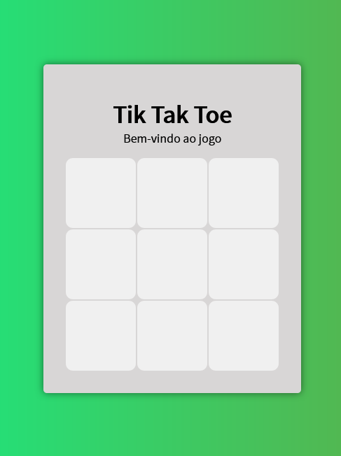
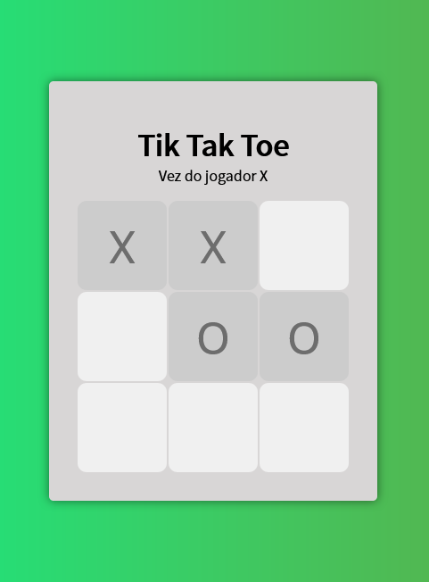
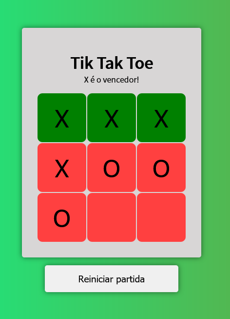
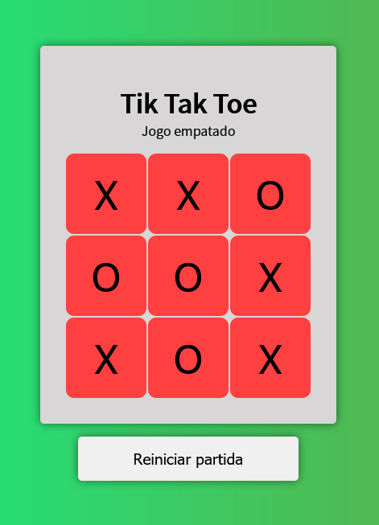

# :video_game: Tik Tak Toe

## :mag_right: Overview

  
  
  
  

## :pushpin: About

Minigame produced with the purpose of training skills like JavaScript language, HTML, CSS, programming logic, DOM manipulation and frontend design.

## :rocket: Technologies

- HTML
- CSS
- JavaScript

## :mailbox_with_mail: Contact Me

---

Made by:

<table>
  <tr>
  <td align="center"> <b><a href="https://linkedin.com/in/marcosadriano05" title="Marcos">Marcos Adriano</a></b> Web Developer</td>
  </tr>
</table>

#NeverStopLearning